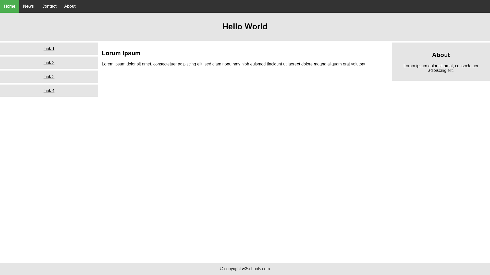
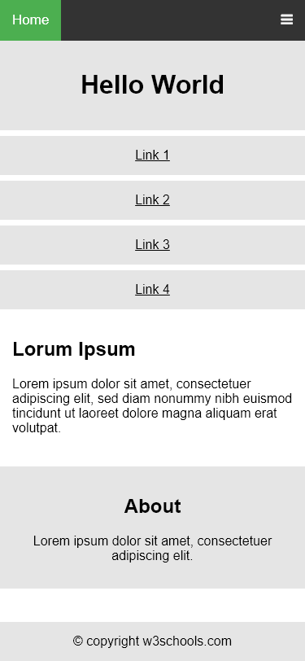

# Responsive Task
- create the expected result so it would look the same as on desktop and on mobile
## Requirements 
- all paddings are 15px
- use font awesome foe the burger menu
`    <link rel="stylesheet" href="https://cdnjs.cloudflare.com/ajax/libs/font-awesome/4.7.0/css/font-awesome.min.css">
`
`    <i class="fa fa-bars"></i>
`
- use the following [website](https://html-color-codes.info/colors-from-image/) to find the colors to use.
- font for the body is `font-family: Arial, Helvetica, sans-serif;` 
- top menu link `font-size: 17px;`
- the side menu with links Link 1,Link 2,Link 3,Link 4 is 20% width on desktop, main part 60%, right part 20%
- left and right parts  margin-top: 7px;
- font=
## How to run the test
In the folder with the package.json folder run `npm install`
In the index.test folder run `jest`
## Expected state

